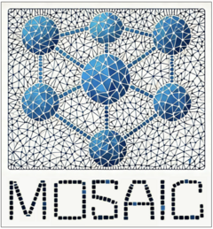

# **MOSAIC-data**: Data for the Metapopulation Outbreak Simulation with Agent-based Implementation for Cholera <a href="https://institutefordiseasemodeling.github.io/MOSAIC-docs/"></a>

This repository contains the processed data used by the **MOSAIC** project, which simulates the transmission dynamics of cholera in Sub-Saharan Africa (SSA). The data provided here supports the work done in [MOSAIC-pkg](https://github.com/InstituteforDiseaseModeling/MOSAIC-pkg) (R package) and [MOSAIC-docs](https://github.com/InstituteforDiseaseModeling/MOSAIC-docs) (documentation).

### Repository Structure

The **MOSAIC-data** repository holds processed data used for simulation, modeling, and analysis. **Note:** The `raw/` directory containing raw data is kept local and is not pushed to the remote repository. Below is an outline of the directory structure:

```bash
MOSAIC-data/       
├── raw/                  # Raw data files (local only)
├── processed/            # Directory for processed data files
│   ├── climate/          # Processed climate data
│   ├── demographics/     # Processed demographic data
│   ├── elevation/        # Processed elevation data
│   ├── ENSO/             # Processed ENSO data (climate oscillations)
│   ├── OAG/              # Processed flight mobility data
│   ├── shapefiles/       # Processed shapefiles for geographical regions
│   ├── WASH/             # Processed Water, Sanitation, and Hygiene (WASH) data
│   └── WHO/              # Processed WHO annual cholera data
│       ├── annual/       # Processed WHO annual cholera data (1949-2024)
│       └── weekly/       # Processed WHO weekly cholera data (2023-2024)
```

## Data Processing

The raw data is processed using methods and functions available in the R package at [MOSAIC-pkg](https://github.com/InstituteforDiseaseModeling/MOSAIC-pkg). The processed data is saved under the `processed/` directory and is used for model inputs, parameter estimations, and other analyses within the MOSAIC framework.

## Contact

For any questions or further information about the **MOSAIC** project, please contact:

- **John Giles**: [john.giles@gatesfoundation.org](mailto:john.giles@gatesfoundation.org)
- **Jillian Gauld**: [jillian.gauld@gatesfoundation.org](mailto:jillian.gauld@gatesfoundation.org)
- **Rajiv Sodhi**: [rajiv.sodhi@gatesfoundation.org](mailto:rajiv.sodhi@gatesfoundation.org)
